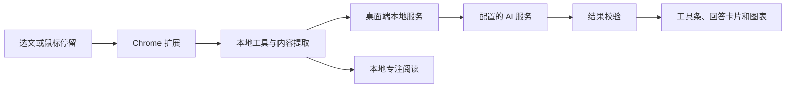

# AttentionUI

**让阅读工具来到你正在关注的内容旁边。**

AttentionUI 是面向学生的 AI 阅读助手，由 Windows 桌面程序和 Chrome 扩展组成。选中一段文字，或在开启自动模式后停留于段落，即可在内容附近使用总结、解释、提问、专注阅读和数据分析工具。


[安装指南](docs/installation.md) · [开发指南](docs/development.md) · [文档目录](docs/README.md) · [问题反馈](https://github.com/Airmoond/attention-ui/issues)

## 功能

| 功能 | 使用方式 |
| --- | --- |
| 内容总结 | 将当前片段整理为摘要，快速掌握重点 |
| 概念解释 | 用更容易理解的语言解释术语或段落 |
| 片段提问 | 围绕当前内容输入问题并获取回答 |
| 专注阅读 | 在独立阅读面板中查看正文，退出后恢复原网页 |
| 图表与数据提取 | 从数字段落或表格中提取数据，生成图表或数据表 |
| 内容感知 | 根据文字、数字、表格或代码内容推荐适合的工具 |
| 习惯排序 | 根据本地工具使用记录逐步调整工具顺序 |
| 网站控制 | 按网站启用，可暂停当前标签页，分别设置自动工具条和自动 AI 推荐 |

AI 正在生成回答、结果已经显示或正在输入问题时，移到其他段落不会覆盖当前交互。

## 快速开始

当前版本为 **0.1.1 学生测试版**。测试安装包由项目团队分发；此仓库提供源码、使用文档和开发记录。

需要 Windows 10/11 64 位系统、Google Chrome，以及用于 AI 功能的兼容 OpenAI 接口的服务配置。

1. 解压测试包，运行 `AttentionUI-Setup-0.1.1.exe`，安装并启动桌面程序。
2. 在桌面端“快速上手”中打开插件文件夹并复制路径。
3. 在 Chrome 的 `chrome://extensions` 开启开发者模式，点击“加载已解压的扩展程序”，选择该文件夹。
4. 将桌面端的配对令牌填入插件“连接与设置”，连接桌面端。
5. 在桌面端“AI 设置”填写 API 地址、API Key 和模型名称，测试连接后保存。
6. 打开支持的网页，在插件弹窗点击“启用此网站”。选中文字，按 **Alt+Shift+F**，或点击弹窗中的“对选中文字使用工具”。

完整操作见 [安装指南](docs/installation.md)。收到测试包后，也可以双击包内的 `安装使用说明书.html` 查看排版完整的离线说明。

默认使用手动入口。希望停留鼠标时出现工具条，可为当前网站开启“鼠标停留时自动显示工具条”；自动 AI 推荐是另一个独立开关。

桌面程序运行时，可以打开内置示例：

- 文章：<http://127.0.0.1:17321/demo/article.html>
- 财经：<http://127.0.0.1:17321/demo/finance.html>

## 当前进度

网页阅读、桌面服务、插件配对及上述工具已经实现，并已提供学生测试包。当前开放本机 Demo、中文／英文维基百科和百度百科正文；真实百科页面的复杂布局正在继续适配。

本地 PDF 阅读与公式识别位于独立的 [PDF 实验工程](tools/pdf-spike/README.md)。已实现连续滚动、缩放、网页全屏、跨页选文，以及混合正文与公式的本机识别尝试，尚未集成到桌面安装包。

接下来的开发重点：

- 完善真实百科页面的内容定位与阅读体验。
- 将 PDF 阅读流程接入正式应用。
- 改进 AI 请求管理、错误恢复与长任务体验。
- 根据学生试用反馈完善安装、升级和日常使用流程。

详细安排见 [0.2 开发方案](docs/plans/v0.2-development-plan.md)。

## 工作原理

Chrome 扩展通过文本选择、鼠标停留和滚动状态推断当前关注内容，提取片段并显示工具。桌面程序负责模型调用、设置保存和本地服务；AI 返回的数据经过校验后，由固定组件展示。



网站由用户主动启用，API Key 保存在桌面端。默认手动模式在点击 AI 工具时发送必要片段；专注阅读和本地工具选择不需要模型调用。

更多细节见 [架构说明](docs/architecture.md) 和 [本地接口](docs/api.md)。

## 本地开发

使用 Windows、Node.js 22.13+、npm 和 Git。在终端执行：

```powershell
git clone https://github.com/Airmoond/attention-ui.git
cd attention-ui
npm ci
npm run build -w packages/shared
npm run build -w apps/extension
npm run dev:desktop
```

在 Chrome 加载 `apps/extension/.output/chrome-mv3`，然后按安装指南完成配对与网站启用。需要扩展热更新时，在另一个终端运行 `npm run dev:extension`，加载开发产物 `apps/extension/.output/chrome-mv3-dev`。

常用检查与构建命令：

```powershell
npm run typecheck
npm test
npm run build
npm run package:release
npm run verify:release
```

扩展浏览器回归、打包输出和 PDF 实验环境见 [开发指南](docs/development.md)。

## 技术栈与目录

桌面端使用 Electron、React、Express；Chrome 扩展使用 WXT、React 和 ECharts；两端通过 TypeScript 与 Zod 共享接口和数据校验。PDF 实验使用 PDF.js 和本机公式识别工具。

```text
attention-ui/
├── apps/
│   ├── desktop/       # Windows 桌面端与本地 AI 服务
│   └── extension/     # Chrome 扩展与网页交互组件
├── packages/shared/   # 两端共享的类型、Schema 与常量
├── demo-pages/        # 文章与数据演示页面
├── tools/pdf-spike/   # 独立 PDF 阅读与公式识别实验
├── scripts/           # 发布检查与浏览器回归
└── docs/              # 使用、开发、架构与验证文档
```

## 反馈与参与

欢迎通过 [GitHub Issues](https://github.com/Airmoond/attention-ui/issues) 提交问题或建议。描述使用场景、复现步骤、预期与实际结果，并附上应用版本和相关截图，便于定位。

参与开发前请阅读 [开发指南](docs/development.md) 和 [项目开发约定](MUST_READ.md)。最近版本的交付范围与验证结果见 [0.1.1 发布记录](docs/releases/attentionui-student-test.md)。
