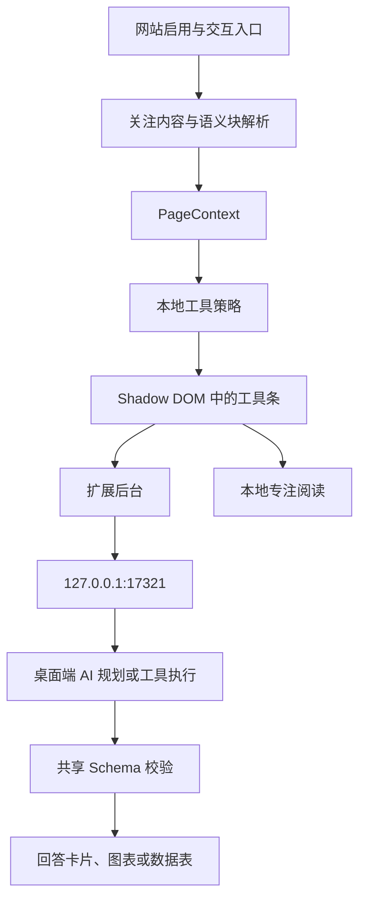

# 架构说明

AttentionUI 由桌面端、Chrome 扩展与共享包组成。扩展负责定位用户关注的内容与显示界面；桌面端负责 AI 调用、本地设置和服务；共享包定义两端使用的类型和校验规则。

## 模块职责

| 模块 | 位置 | 职责 |
| --- | --- | --- |
| 桌面端 | `apps/desktop` | 设置界面、API 配置、本地 HTTP 服务、插件配对、工具执行、习惯存储、托盘和日志 |
| 浏览器扩展 | `apps/extension` | 网站控制、关注内容推断、语义块定位、片段提取、工具条、结果卡片和专注阅读 |
| 共享包 | `packages/shared` | 工具 ID、接口类型、Schema、错误码与默认值 |
| PDF 实验 | `tools/pdf-spike` | PDF 阅读、文字选择和混合正文公式处理，独立于正式双端应用 |

## 一次阅读交互

1. 用户启用当前网站，通过选文快捷键或自动工具条入口触发交互。
2. 扩展解析正文、表格或代码等语义块，形成 `PageContext`。
3. 本地规则立即生成工具候选；开启自动 AI 推荐时，再请求桌面端规划工具。
4. 用户点击总结、解释、提问、图表或数据提取后，扩展后台调用桌面端接口。
5. 桌面端使用配置的模型生成结果，并通过共享 Schema 校验。
6. 扩展使用固定 React 组件显示结果。专注阅读由扩展本地执行。

## 界面与状态

扩展界面放在 Shadow DOM 中，避免与网页样式互相影响。工具与结果来自固定组件，AI 生成工具选择和展示数据。

自动悬停只在允许切换内容时建立新交互。等待 AI、显示结果、输入问题或专注阅读期间保留当前会话；关闭、禁用或暂停后，过期响应不能重新打开界面。

网站设置分别记录启用、自动工具条和自动 AI 推荐；暂停状态按标签页区分。工具使用次数按内容类型保存在本机，用于排序。

## 本地服务与数据

桌面端只监听 `127.0.0.1:17321`。插件先用配对令牌换取客户端令牌，后续受保护请求使用 Bearer 认证。API Key 保存在桌面端，由桌面端调用所配置的服务商。

扩展按网站权限和启用状态决定是否运行。选文模式只保留所选片段，排除输入框和可编辑区域；发送的上下文去掉 URL 查询参数与片段，并省略页面标题和邻近标题。

接口列表见 [本地接口](api.md)，开发与调试方法见 [开发指南](development.md)。
